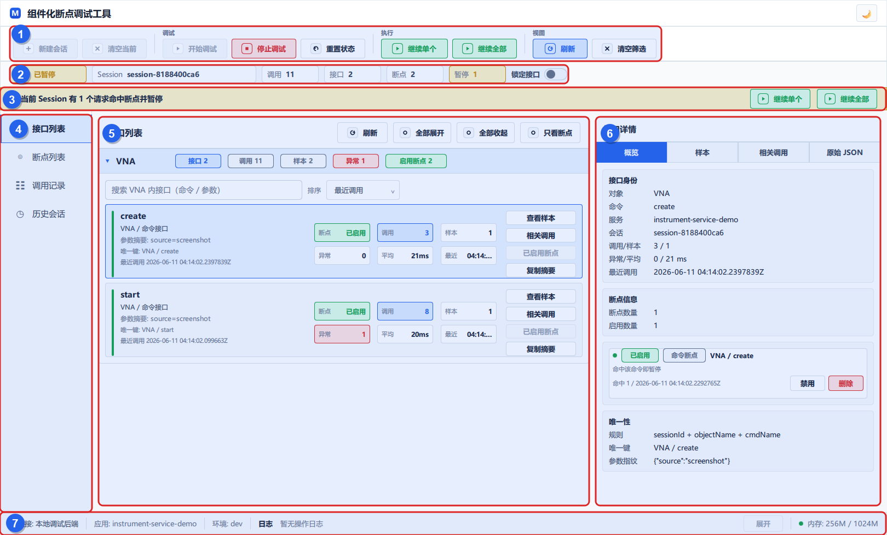
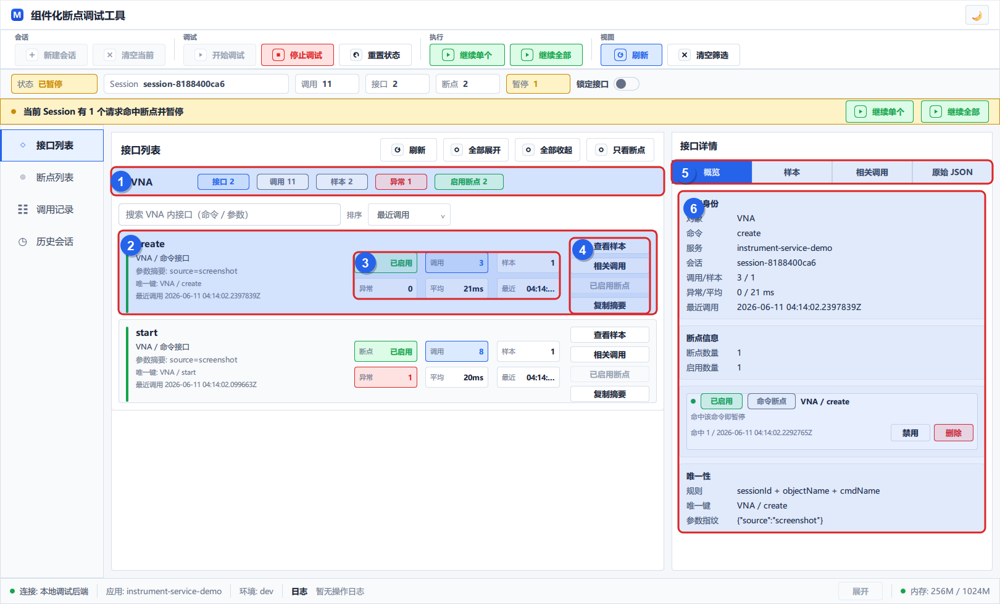
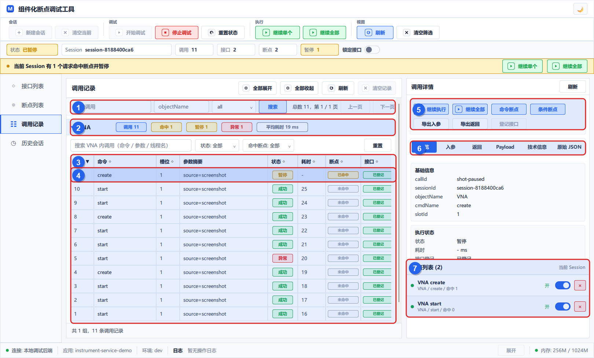
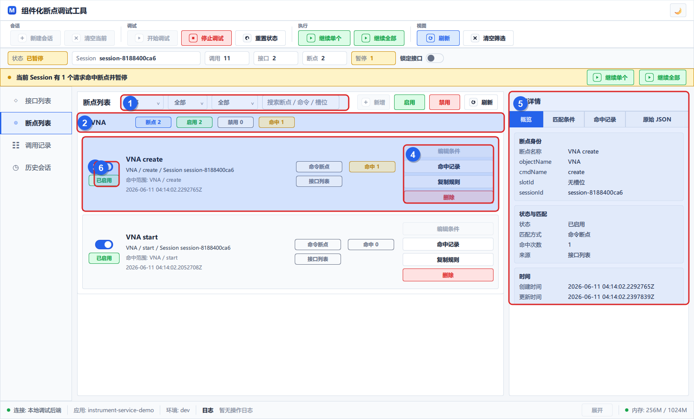
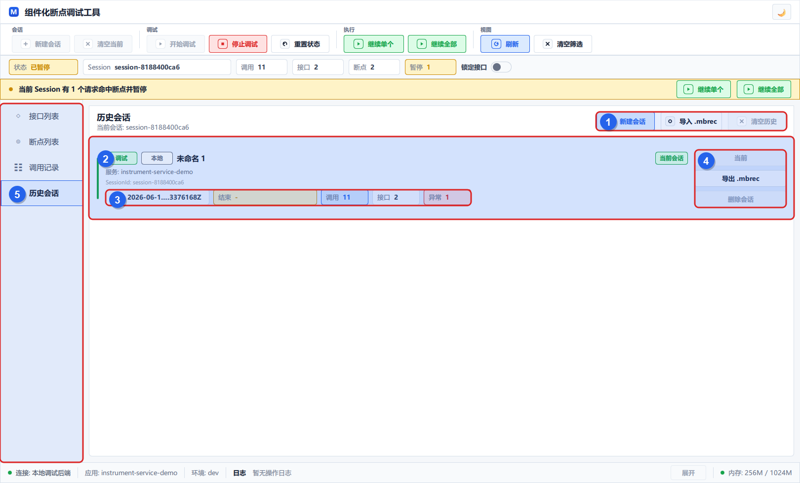

# 组件化断点调试工具用户指导手册

本手册面向已经安装好断点调试工具的用户。它说明如何在桌面界面中管理会话、发现接口、创建断点、查看调用和继续执行，也说明业务 Java 服务必须如何做侵入式接入。

截图使用当前软件真实运行界面和演示数据生成。实际 SessionId、时间、调用数量会随运行环境变化。

## 1. 工具用途

组件化断点调试工具用于在 Java 业务命令入口处暂停请求、查看入参和返回值，并由界面控制请求继续执行。当前模型只有“开始调试 / 停止调试”：

- 点击“开始调试”后，Java 上报的 before-call 才会进入当前 Session，并参与接口发现和断点判断。
- 点击“停止调试”后，新的 Java before-call 会直接放行，不再写入当前 Session。
- Java 请求由真实业务系统、接口工具或脚本触发，桌面端只负责观察、断点和继续执行。

常用概念：

| 概念 | 含义 |
| --- | --- |
| Session | 一次调试会话，保存接口、调用记录、断点和归档信息。 |
| 接口 | 按 `sessionId + objectName + cmdName` 发现的业务命令入口。 |
| 调用记录 | Java 每次上报 before-call / after-call 后形成的执行记录。 |
| 命令断点 | 命中同一 `objectName + cmdName` 下的所有槽位调用。 |
| 条件断点 | 基于调用或参数样本创建，按槽位和参数条件更精确命中。 |
| `.mbrec` | 单个 Session 的导入导出归档文件。 |

## 2. 主界面总览



1. 顶部工具栏：新建会话、清空当前、开始/停止调试、重置状态、继续单个、继续全部、刷新和清空筛选。
2. 状态栏：显示当前状态、Session、调用数、接口数、断点数、暂停数和“锁定接口”开关。
3. 暂停提示条：有请求命中断点并暂停时显示，可直接继续单个或继续全部。
4. 左侧导航：在接口列表、断点列表、调用记录和历史会话之间切换。
5. 主工作区：显示当前页面的数据列表和主要操作。
6. 右侧详情区：显示当前选中接口、断点或调用的详情。
7. 底部日志栏：显示最近一次界面操作的返回摘要，点击“展开”可查看完整 JSON。

顶部状态建议这样判断：

- `空闲`：有 Session，但未开始调试。
- `调试中`：Java 调用会被记录和判断断点。
- `已暂停`：至少一个请求命中断点并等待继续。
- `无会话`：需要先新建或打开 Session。

## 3. 完成一次断点调试

1. 打开工具后，点击“新建会话”。
2. 点击“开始调试”。
3. 通过真实业务系统、接口工具或脚本触发 Java 业务接口。
4. 在“接口列表”确认接口被发现，在“调用记录”确认调用被记录。
5. 在“接口列表”点击“创建断点”，或在“调用记录”详情里点击“命令断点 / 条件断点”。
6. 再次触发同一个 Java 业务接口。
7. 命中断点后，界面顶部出现暂停提示，调用状态变为“暂停”。
8. 查看入参、返回、Payload 和技术信息后，点击“继续单个 / 继续执行”或“继续全部”。
9. 调试完成后点击“停止调试”。

注意：停止调试后再次触发 Java 接口，业务会继续执行，但不会新增当前 Session 的调用记录。

## 4. 接口列表



1. 对象分组：按 `objectName` 折叠展示，显示接口数、调用数、样本数、异常数和启用断点数。
2. 接口卡片：展示命令名、对象、参数摘要、唯一键和最近调用时间。
3. 指标区：显示断点状态、调用次数、样本数、异常数、平均耗时和最近调用。
4. 操作区：查看样本、查看相关调用、创建断点或复制摘要。
5. 详情页签：可切换概览、样本、相关调用和原始 JSON。
6. 接口详情：展示接口身份、断点信息、唯一性规则和已关联断点。

接口列表的唯一性规则是 `sessionId + objectName + cmdName`。`slotId` 不拆分接口，只用于调用记录、参数样本和条件断点条件。

“锁定接口”只阻止新接口自动加入接口列表，不影响调用记录保存、断点判断或暂停逻辑。锁定期间出现的新接口会在调用记录中标为“未登记”，可以从调用详情手动登记。

## 5. 调用记录



1. 搜索与分页：按关键字、`objectName`、状态和每页数量筛选当前 Session 的调用。
2. 分组统计：按 `objectName` 展示调用数、命中数、暂停数、异常数和平均耗时。
3. 调用表格：默认展示序号、命令、槽位、参数摘要、状态、耗时、断点和接口。
4. 选中行：浅色高亮当前调用，暂停行会显示“暂停”和“已命中”。
5. 快捷操作：继续执行、继续全部、创建命令断点、创建条件断点、导出入参、导出返回和登记接口。
6. 详情页签：查看概览、入参、返回、Payload、技术信息和原始 JSON。
7. 当前 Session 断点列表：可快速启用、禁用或删除相关断点。

点击“清空记录”只删除当前 Session 的调用记录，接口列表、参数样本和断点会保留。顶部工具栏的“清空当前”才会清空当前 Session 的接口、调用记录、参数样本和相关断点。

Payload 较大时，列表只显示摘要。完整内容保存在后端 payload 存储中，可在详情页按需加载、搜索或导出。

## 6. 断点列表



1. 筛选区：按对象、启用状态、来源和关键字筛选断点。
2. 对象分组：按 `objectName` 展示断点数量、启用数量、禁用数量和命中数量。
3. 断点卡片：展示断点名称、命中范围、Session 和创建时间。
4. 操作区：查看命中记录、复制规则或删除断点。条件编辑当前不可用。
5. 断点详情：查看概览、匹配条件、命中记录和原始 JSON。
6. 启用开关：开关关闭后断点保留但不再命中。

命令断点适合“只要调用这个对象命令就暂停”的场景。条件断点适合“只暂停某个槽位、某组参数或某个历史样本”的场景。

## 7. 历史会话与归档



1. 顶部操作：新建会话、导入 `.mbrec`、清空历史。
2. 会话卡片：展示会话来源、名称、服务名、SessionId 和当前状态。
3. 统计信息：展示开始/结束时间、调用数、接口数和异常数。
4. 会话操作：打开会话、导出 `.mbrec` 或删除会话。
5. 左侧导航：历史会话页用于切换和归档，不负责触发 Java 请求。

`.mbrec` 用于归档单个 Session。导入归档会创建一个新的本地会话，不会合并到当前会话，也不会覆盖原有历史。导入时可以选择“导入后锁定接口”，用于回看历史数据时避免新流量扩展接口列表。

## 8. Java 侵入式接入

这个工具不能自动拦截任意 Java 方法。业务服务必须在需要调试的命令入口处做侵入式修改：把原业务逻辑包进 `DebugInvoker.invoke(...)`。

### 8.1 配置调试器地址

在业务 Java 服务中配置断点调试工具地址。示例：

```yaml
debugger:
  enabled: true
  server-url: http://127.0.0.1:18601
  service-name: instrument-service-demo
  connect-timeout-ms: 300
  read-timeout-ms: 1000
  breakpoint-timeout-ms: 300000
```

字段说明：

| 字段 | 说明 |
| --- | --- |
| `enabled` | 是否启用调试上报；设为 `false` 时直接执行原业务逻辑。 |
| `server-url` | 断点调试后端地址，默认端口是 `18601`。 |
| `service-name` | 当前业务服务名称，会显示在界面中。 |
| `connect-timeout-ms` | 连接调试后端的超时时间。 |
| `read-timeout-ms` | before-call / after-call 普通请求超时时间。 |
| `breakpoint-timeout-ms` | 命中断点后等待继续执行的最长时间。 |

### 8.2 改造业务方法

改造前，业务方法通常直接执行真实逻辑：

```java
public ValueResult instrumentControl(
        String instType,
        String cmdName,
        int slotId,
        Map<String, Object> params) {
    sleep(500);
    return ValueResult.success(
            String.format("%s%d: %s success.", instType, slotId, cmdName),
            params
    );
}
```

改造后，把真实逻辑放到 `DebugInvoker.invoke(...)` 的回调里：

```java
public ValueResult instrumentControl(
        String instType,
        String cmdName,
        int slotId,
        Map<String, Object> params) {
    return DebugInvoker.invoke(
            DebugMethodInfo.commonMethodData(
                    instType,
                    cmdName,
                    "instrumentControl",
                    slotId,
                    params
            ),
            () -> {
                sleep(500);
                return ValueResult.success(
                        String.format("%s%d: %s success.", instType, slotId, cmdName),
                        params
                );
            }
    );
}
```

`DebugMethodInfo.commonMethodData(...)` 的参数映射：

| 参数 | 映射到界面 | 建议 |
| --- | --- | --- |
| `instType` | `objectName` | 填业务对象、设备类型或组件名，例如 `VNA`、`SA`。 |
| `cmdName` | `cmdName` | 填业务命令名，例如 `create`、`start`、`INIT`。 |
| `methodName` | 技术信息 | 填 Java 方法名，便于排查来源。 |
| `slotId` | 槽位 | 填设备槽位、通道、实例编号；没有槽位可传 `null`。 |
| `params` | 入参与条件断点 | 填希望在界面查看和用于断点匹配的参数。 |

### 8.3 接入后的执行行为

- `DebugInvoker` 会先向调试后端发送 before-call。
- 如果没有命中断点，业务逻辑立即执行。
- 如果命中断点，当前 Java 请求线程会等待界面点击“继续执行 / 继续全部”，或等待到 `breakpoint-timeout-ms` 后继续。
- 业务执行成功后会上报 after-call 和返回值。
- 业务抛出异常时会上报异常信息，然后继续按原逻辑抛出异常。
- 调试后端不可用时，Java 侧只打印警告并继续执行业务，不应阻断正常请求。

### 8.4 改造建议

- 只改造需要断点调试的业务入口，不要包裹所有内部小方法。
- 把 `DebugInvoker.invoke(...)` 放在真实业务逻辑外层，确保暂停发生在业务动作执行之前。
- `params` 应只放调试需要的业务参数；超大对象可以上报，但界面列表只显示摘要。
- 生产环境如不需要断点能力，应设置 `debugger.enabled=false` 或不加载相关配置。
- 接入完成后，启动工具、新建 Session、开始调试，再调用业务接口，确认“调用记录”和“接口列表”都有新增数据。

## 9. 常见问题

### 没有调用记录

先确认当前 Session 已点击“开始调试”。如果处于“空闲”或“无会话”，Java before-call 会直接放行或无法归入会话。

### 接口列表没有新增接口，但调用记录有数据

检查状态栏“锁定接口”是否打开。锁定后新接口不会自动登记，但调用记录仍会保存，可以从调用详情点击“登记接口”。

### 断点没有暂停

确认断点处于“已启用”，并确认触发的 Java 调用具有相同的 `objectName + cmdName`。条件断点还需要槽位和参数条件匹配。

### Java 请求一直等待

界面点击“继续单个 / 继续执行”或“继续全部”。如果无人处理，Java 侧会在 `breakpoint-timeout-ms` 到达后继续执行。

### 停止调试后为什么业务仍然成功

停止调试只是不再记录和判断断点，不会关闭 Java 业务服务，也不会阻断业务请求。

### Payload 太大看不全

列表只显示摘要。进入调用详情的 Payload 页签后再加载、搜索或导出完整内容。
